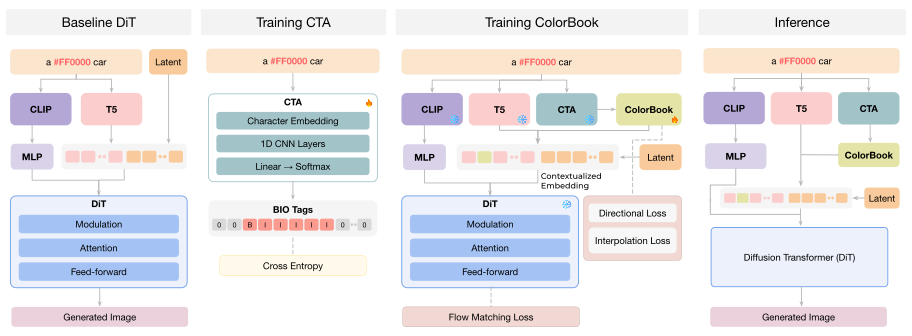
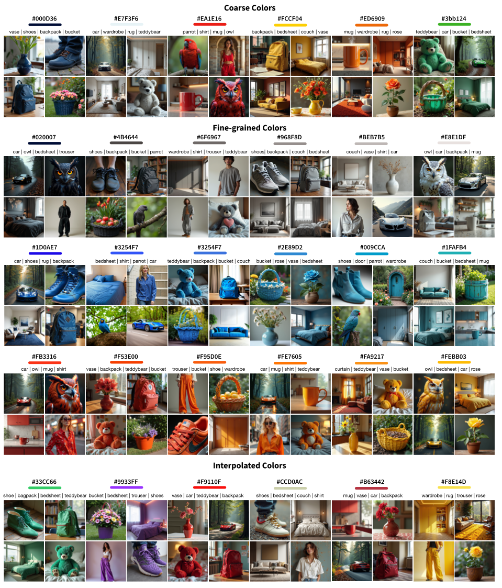

# NumColor: Precise Numeric Color Control in Text-to-Image Generation

> **Accepted at European Conference on Computer Vision 2026** 🎉

**[Muhammad Atif Butt](https://scholar.google.com/citations?user=vf7PeaoAAAAJ&hl=en)**, **[Diego Hernández](https://scholar.google.com/citations?user=6SBoE-YAAAAJ&hl=en)**, **[Alexandra Gomez-Villa](https://scholar.google.com/citations?user=A2dhwNgAAAAJ&hl=en)**, **[Kai Wang](https://scholar.google.com/citations?user=j14vd0wAAAAJ&hl=en)**, **[Javier Vazquez-Corral](https://scholar.google.com/citations?user=gjnuPMoAAAAJ&hl=en)**, **[Joost van de Weijer](https://scholar.google.com/citations?user=Gsw2iUEAAAAJ&hl=en)**

Computer Vision Center (CVC), Barcelona, Spain.
Computer Sciences Department, Universitat Autònoma de Barcelona, Barcelona, Spain.
Program of Computer Science, City University of Hong Kong (Dongguan), China.
City University of Hong Kong, China.

[](https://arxiv.org/pdf/2603.13547)

---

## Overview

NumColor is a two-stage framework for **precise numerical color control** in text-to-image diffusion models. Given a natural language prompt containing hex color codes (e.g., `"a #FF5733 car next to a #2E86AB building"`), NumColor produces images whose object colors faithfully match the specified numeric values.

The framework introduces:

- **Color Token Aggregator (CTA):** A tokenizer-agnostic, learned module that detects and aggregates fragmented color tokens (hex codes / CSS-style color references) into coherent, injectable representations.
- **ColorBook:** A perceptually-structured color codebook trained on Lambertian-rendered data with calibrated D65 illumination, enabling precise mapping from numeric color specifications to T5 embedding space.
- **NumColor-Data:** A 500K synthetic dataset for training color-grounded conditioning.

## Method

<p align="center">
  
</p>

NumColor replaces fragmented color-token embeddings with ColorBook entries **before contextualization** in the T5 text encoder. This allows the color embeddings to flow through self-attention alongside text tokens, binding colors to their target objects without modifying the diffusion backbone.

## Results

<p align="center">
     <!-- <source srcset="assets/nucolor_method.svg" type="image/svg+xml"> -->
     
</p>

NumColor preserves the base model's pretrained named-color understanding: FLUX.1 achieves 81.27% accuracy on natural color prompts, while NumColor + FLUX.1 attains 80.04% on the same set.

## Release

> 🚧 **Code, pretrained models, and the NumColor-Data / GenColorBench datasets will be released soon.** Please ⭐ this repository to be notified.

Planned releases:

- [ ] Training and inference code
- [ ] Pretrained CTA and ColorBook checkpoints (FLUX.1)
- [ ] NumColor-Data (500K synthetic training set)

## Citation

If you find this work useful, please cite:

```bibtex
@article{butt2026numcolor,
  title={NumColor: Precise Numeric Color Control in Text-to-Image Generation},
  author={Butt, Muhammad Atif and Hernandez, Diego and Gomez-Villa, Alexandra and Wang, Kai and Vazquez-Corral, Javier and Van De Weijer, Joost},
  journal={arXiv preprint arXiv:2603.13547},
  year={2026}
}
```

## Acknowledgements

Computational resources were provided by the Leonardo HPC cluster (CINECA). We are thankful for that.

## Contact

For questions or collaborations, please contact [Muhammad Atif Butt](mailto:mabutt@cvc.uab.es) or open an issue in this repository.
